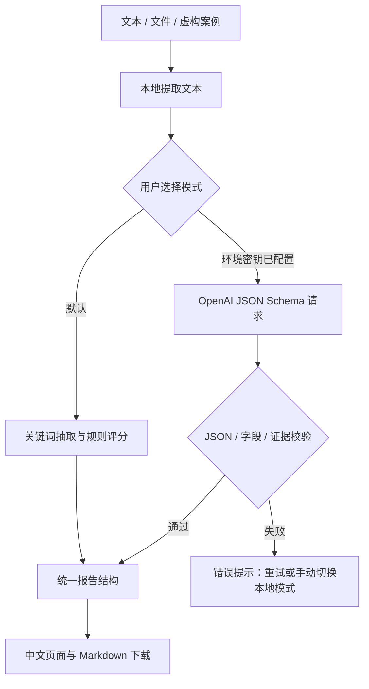

# AI 商业需求诊断助手

`ai-business-solution-agent` · Python / Streamlit · 个人作品集原型

面向售前、商业分析和客户成功人员，将客户访谈与业务资料整理成可讨论、可编辑的诊断报告。默认使用无需 API Key 的本地规则模式，也提供可选 LLM 增强模式。


## 业务问题

初次客户访谈往往混合了业务目标、现用工具、流程困难和待核实信息。售前需要把这些信息整理为“问题—依据—方案—下一步问题”，才能讨论数字化协作、知识管理、流程管理和数据管理的切入点。

本项目展示从业务资料到方案讨论稿的过程，不替代需求访谈，也不声称方案已经交付或产生商业收益。

## 功能演示

| 功能 | 当前实现 |
| --- | --- |
| 资料输入 | 粘贴文本，上传 `.txt`、`.md`、`.csv`、`.xlsx` |
| 本地规则 | 关键词抽取目标、角色、工具、关注点和痛点信号 |
| 优先级 | 本地影响与紧迫度各 1–3 分，按 `影响 × 2 + 紧迫度` 降序排列；同分按证据数排序。8 分起为高、5 分起为中，其余为低 |
| 证据摘录 | 本地原文句子；LLM 对摘录进行忽略空白后的子串匹配校验 |
| 建议与追问 | 痛点关联建议；缺少规则匹配信息时生成补充问题 |
| LLM 增强 | OpenAI Responses API、JSON Schema、应用端字段与证据校验 |
| 下载 | 两种模式均可下载 Markdown 报告，保留模式标识、证据和问题 |

### 两个虚构案例

- **游戏发行团队**：[海外发行访谈纪要](data/demo_game_publisher.md)。涉及市场验证、素材交付、跨部门配合、渠道合作与数据口径。
- **消费品牌团队**：[渠道与活动资料](data/demo_consumer_brand.xlsx)。包含虚构访谈和活动记录，涉及经销商资料、活动排期、审批与复盘。

运行后选择案例 → 点击“生成结构化诊断报告” → 核对证据与建议 → 下载 Markdown。两个案例的名称、业务细节和数字均为演示构造，不代表真实企业。

## 系统流程



本地诊断与 LLM 调用独立，二者转换为相同的报告结构。LLM 请求失败不会自动重复请求，也不会自动生成一份伪装为模型结果的本地报告。

## 技术栈与结构

Python、Streamlit、Pandas、OpenPyXL（读取 Excel）、OpenAI SDK、python-dotenv、Pytest。当前没有向量数据库、RAG 或多智能体编排。

```text
ai-business-solution-agent/
├── app.py                     # 中文交互、模式选择、下载入口
├── src/
│   ├── ingest.py              # 文件读取与表格文本化
│   ├── retrieve.py            # 句子切分与关键词证据检索
│   ├── diagnose.py            # 本地规则、评分与补充问题
│   ├── llm.py                 # 模型调用、校验、报告适配
│   └── report.py              # Markdown 报告
├── data/                      # 虚构案例与 Excel 预览
├── docs/                      # 录制脚本、审查记录、简历描述
├── screenshots/               # 截图位置说明
├── tests/                     # 无真实 API 调用的自动化测试
├── scripts/create_demo_xlsx.mjs # Excel 示例生成工具；运行应用不需要
├── requirements.txt
├── .env.example               # 空密钥模板
└── .gitignore
```

Excel 文件已经包含在项目中。可选的示例生成脚本依赖 `@oai/artifact-tool`，不属于 Python 快速开始步骤，不需要为运行应用安装 Node.js。

## 快速开始

建议 Python 3.12（当前测试环境）。下载仓库或克隆自己的 GitHub 仓库后，进入项目根目录。

Windows PowerShell：

```powershell
python -m venv .venv
.\.venv\Scripts\python.exe -m pip install -r requirements.txt
.\.venv\Scripts\python.exe -m streamlit run app.py --server.address 127.0.0.1
```

macOS / Linux：

```bash
python3 -m venv .venv
.venv/bin/python -m pip install -r requirements.txt
.venv/bin/python -m streamlit run app.py --server.address 127.0.0.1
```

打开 <http://localhost:8501>，默认本地规则模式无需密钥，也不会发起模型请求。初次安装依赖需要联网。结束时在终端按 Ctrl+C。

### 可选 LLM 配置

`.env.example` 只列出空的 `OPENAI_API_KEY`、`OPENAI_MODEL` 变量，不包含凭据。优先通过运行进程的环境变量或部署平台的秘密管理功能注入密钥。如使用本机 `.env`，复制模板后仅在本机编辑它；应用使用 python-dotenv 加载，已有环境变量优先。

模型默认值见 `src/llm.py`，也可通过 `OPENAI_MODEL` 指定账户有权限、支持 Responses 与结构化输出的模型。配置后重启应用，切换“LLM 增强模式”并点击生成。不要把真实密钥写进 README、示例文件、截图、录屏或提交历史。

LLM 会发送本次资料名称与提取文本到 OpenAI，可能产生费用。请仅使用虚构或已获授权并完成脱敏的资料。缺少密钥、请求失败或 JSON/证据校验失败时，页面提供错误提示，可手动切回本地模式。

### 验证

```powershell
.\.venv\Scripts\python.exe -m pytest -q
```

macOS / Linux 使用 `.venv/bin/python -m pytest -q`。测试覆盖本地规则、证据追溯、缺失信息、LLM 输出校验、文件输入和页面本地生成流程。测试不消费模型额度。真实 API 连接、模型可用性与诊断质量需要单独验证。

## 隐私与局限性

- 程序没有用户数据库或上传文件落盘逻辑，资料在应用进程/会话内处理；本地模式不发送资料给模型。远程部署时，上传内容会先到部署服务器，因此不应笼统理解为“永不离开用户电脑”。
- `.env`、环境变体、日志和 Streamlit secrets 已配置忽略。忽略规则不能删除已进入 Git 历史的秘密；若曾泄露，必须撤销或轮换密钥。审查只覆盖当前交付文件，详见 [审查记录](docs/review.md)。
- 规则可能把普通名词、否定句或期望状态误识别为痛点；未匹配到信息不代表客户没有该问题。规则缺少影响或时限信号时仍赋低分，而非“已确认影响低”。
- 本地建议来自问题类别模板；优先级是加权启发式评分，不是客户确认结果，也不是严格的“先影响、再紧迫”排序。LLM 等级与排序理由由模型提供，需人工复核。
- 证据字符串匹配只能证明摘录存在，不能证明结论由证据充分支持。LLM 仍可能产生错误解读。背景证据缺失时，当前校验会拒绝整份 LLM 结果。
- 表格最多转入前 5 个工作表、每表前 80 行；界面原文预览最多 7,000 字符。文件仍可能整体读取，不适合超大文件。CSV 默认 UTF-8，尚未提供自动编码识别或完整数据统计。
- 无登录、配额、访问控制或生产监控。默认本机预览，不建议携带服务器密钥直接开放公网。
- 本项目是个人原型，无真实用户量、性能收益或商业成果的测量结论；不构成已完成的客户交付。

## 学习与后续方向

本项目通过资料处理、结构化输出和报告表达实践 AI 应用开发。

后续可评估：否定与冲突信息处理、人工修改报告、可度量的诊断评估集、表格行/单元格定位，以及检索增强。以上均为规划，不列为已完成功能。
