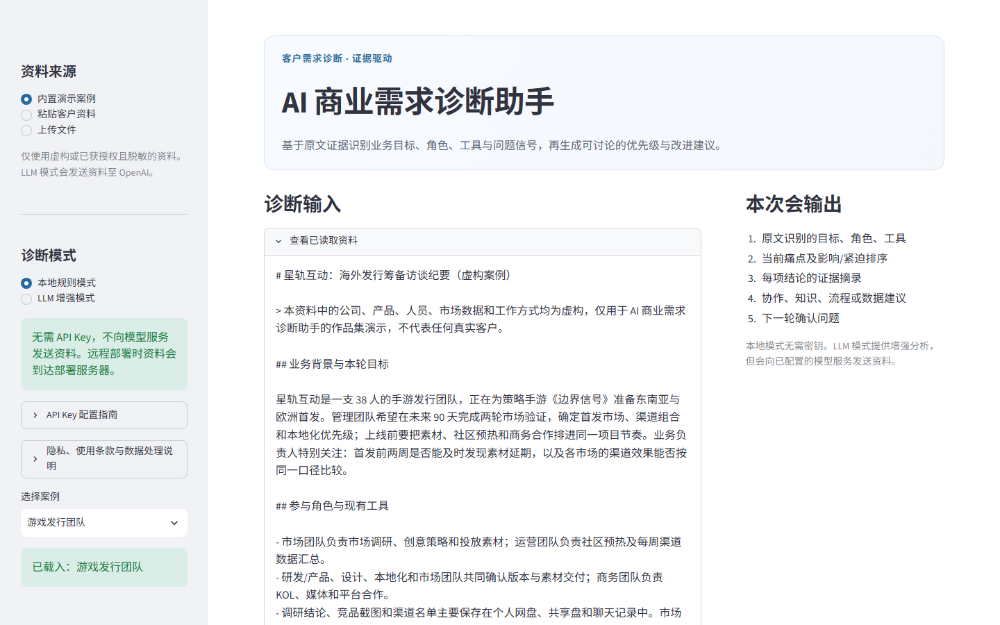
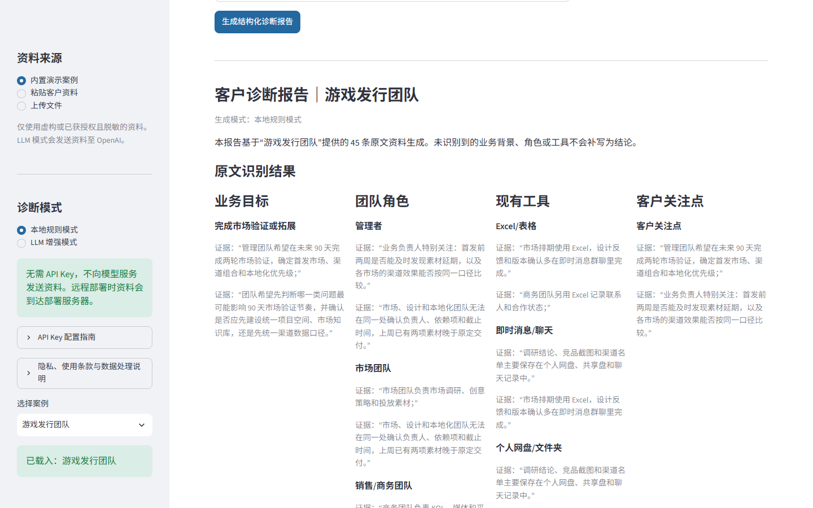
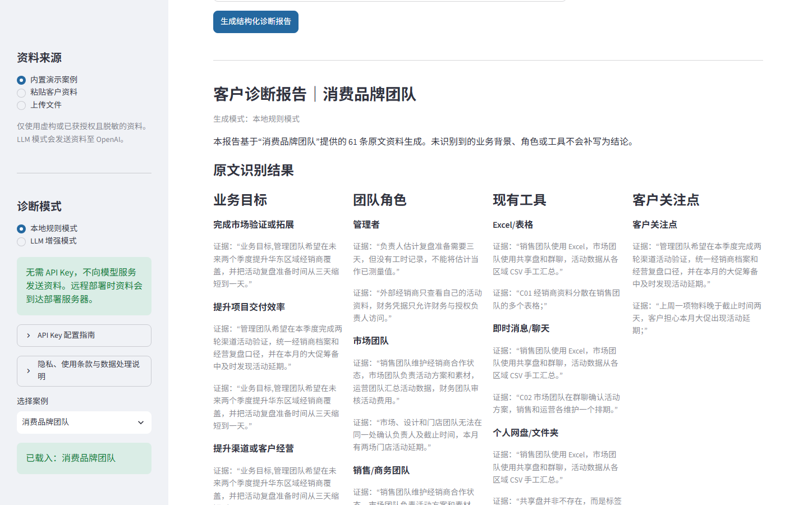
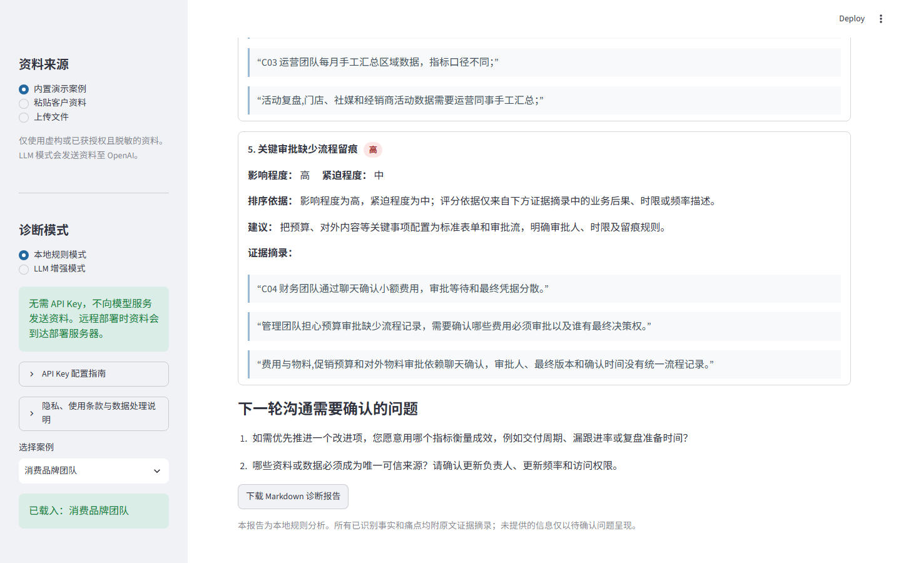
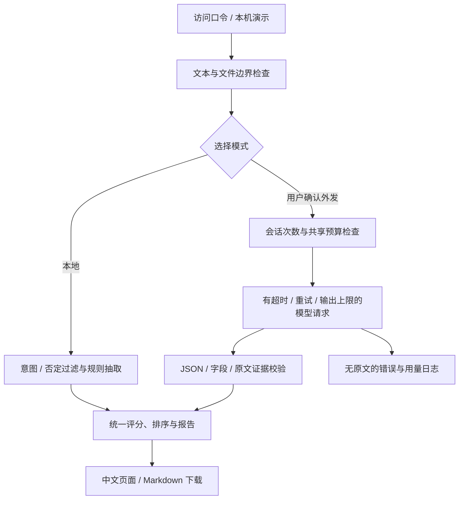

# AI 商业需求诊断助手

`ai-business-solution-agent` · v0.2.0 · Python / Streamlit · MIT

面向售前、商业分析和客户成功人员，把访谈与业务表格整理成“目标—痛点—证据—优先级—建议—追问”。保留无需密钥的本地规则模式，也支持可选 OpenAI 模式。当前适用于作品集和单机/单实例受控试点，不承诺企业生产交付或真实客户准确率。

[观看 / 下载 2 分钟演示](media/demo-local.mp4) · [试点交付指南](docs/delivery-guide.md) · [部署与运维](docs/deployment.md) · [评估说明](docs/evaluation.md)

视频是真实页面的自动操作静音录屏，配中文讲解字幕；使用虚构案例与本地模式，未调用真实 API。



## 业务问题

客户初访材料常混合目标、当前流程、工具、问题和不确定信息。售前人员需要将其变成可追溯的讨论稿，确定先解决哪个问题、方案如何试点，以及下一轮要问什么。

本项目展示这一整理过程，诊断结果仍须人工核对，不将未经确认的建议或数字写成客户承诺。

## 功能演示与配套案例

- 支持粘贴文本和上传 TXT、Markdown、CSV、XLSX。
- 识别业务目标、角色、现有工具、客户关注点与五类问题信号。
- 两种模式均按 `影响×2+紧迫度` 计算分数、排序：8–9 为高，5–7 为中，3–4 为低；任一等级待确认则分数为 0、优先级待确认。同分按证据数排序。
- 每项事实与痛点附原文摘录；缺失信息转为追问。LLM 输出必须通过 JSON、字段、等级和证据校验。
- 下载 Markdown 报告；当前会话保留报告，更换输入或模式后清除旧报告。
- 可选访问口令、共享持久化每日预算、会话请求限额和安全日志。

**游戏发行**：[完整访谈](data/demo_game_publisher.md)，涵盖素材交付、市场验证、合作交接与渠道口径。



**消费品牌**：[完整访谈](data/demo_consumer_brand.md) + [Excel 资料](data/demo_consumer_brand.xlsx)，涵盖经销商主档、活动排期、审批与经营复盘。页面联合分析两份材料，也可分别上传。



两个案例全部虚构，并有流程编号、资源约束、未知信息。配套 [四周试点设计](docs/delivery-guide.md) 给出责任角色、推进步骤与验收参考，不代表已实施成果。



=======
>>>>>>> origin/main
## 系统流程


```mermaid
flowchart TD
    A[访问口令 / 本机演示] --> B[文本与文件边界检查]
    B --> C{选择模式}
    C -->|本地| D[意图 / 否定过滤与规则抽取]
    C -->|用户确认外发| E[会话次数与共享预算检查]
    E --> F[有超时 / 重试 / 输出上限的模型请求]
    F --> G[JSON / 字段 / 原文证据校验]
    D --> H[统一评分、排序与报告]
    G --> H
    H --> I[中文页面 / Markdown 下载]
    F --> J[无原文的错误与用量日志]
```

同一原句可以支撑目标与角色等不同事实，这不等于重复独立证据。角色优先选择含职责的句子；规则不保证所有分类互斥，也不保证证据足以支持结论。

## 技术栈与交付目录

Python、Streamlit、Pandas、OpenPyXL、OpenAI SDK、python-dotenv、SQLite、Pytest/Coverage、Ruff、Mypy、Docker、GitHub Actions。没有自训模型、向量数据库、RAG 或多智能体。

```text
app.py                  中文页面、访问门、外发确认与下载
src/                    输入、规则、LLM、评分、预算、日志与启动检查
data/                   完整虚构案例与 25 条标注评估样例
docs/                   隐私、使用条款、处理说明、试点、部署与评估
screenshots/            4 张实际页面截图
media/demo-local.mp4    2 分钟实际页面静音录屏
scripts/                评估、干净打包与可重复录屏
tests/                  自动化测试（无真实模型调用）
.streamlit/config.toml  5 MB 上传上限、关闭统计、保留 CORS/XSRF
.github/workflows/      测试、规范、类型、评估、打包与容器检查
Dockerfile / compose.yaml
pyproject.toml / LICENSE / CHANGELOG.md
```

## 快速开始

推荐 Python 3.12，已在 Windows Python 3.14.3 验证本地流程。

Windows PowerShell，进入项目根目录：

```powershell
python -m venv .venv
.\.venv\Scripts\python.exe -m pip install -r requirements.txt
.\.venv\Scripts\python.exe -m streamlit run app.py --server.address 127.0.0.1
```

macOS / Linux：

```bash
python3 -m venv .venv
.venv/bin/python -m pip install -r requirements.txt
.venv/bin/python -m streamlit run app.py --server.address 127.0.0.1
```

打开 <http://localhost:8501>。本地模式无需密钥；停止时按 Ctrl+C。

### 可选 API 配置

仅在没有 `.env` 时复制 `.env.example`，然后在本机编辑；已有系统环境变量优先。密钥只保留在本机或平台秘密管理中，不要放进网页、聊天、截图、文档或 Git。

```powershell
Copy-Item .env.example .env
code .env
```

选择一种服务商：OpenAI 使用 `LLM_PROVIDER=openai` 和 `OPENAI_API_KEY`；DeepSeek 使用 `LLM_PROVIDER=deepseek`、`DEEPSEEK_API_KEY` 和账户可用的 `DEEPSEEK_MODEL`（模板默认 `deepseek-flash`）。两种密钥均只从环境读取。重启应用，选择 LLM 模式并确认外发资料。OpenAI 使用 Responses 严格 JSON Schema；DeepSeek 使用 Chat JSON 模式，再由应用校验完整字段、等级和原文证据，校验失败不展示报告。不是任意厂商 API 的通用适配器。

| 护栏 | 默认 / 行为 |
| --- | --- |
| 输入 | 文件 ≤5 MB；提取或粘贴文本 ≤60,000 字符；超限明确拒绝 |
| 表格 | 最多 10 个 sheet、每表 1,000 行（Excel 含标题表头）与 50 列；无静默截断 |
| 编码 | UTF-8/BOM 优先，失败后尝试 GB18030 |
| Excel | 解压体积 ≤20 MB、成员 ≤1,000、压缩比 ≤200；拒绝宏、外链与 XML 实体定义 |
| 请求 | 单次 SDK 尝试超时默认 30 秒（可设 1–60）；最多 1 次重试（可设 0–2） |
| 输出 | 默认最多 6,000 tokens（可设 256–12,000）；不完整输出拒绝 |
| 配额 | 每会话 5 次模型操作；共享每日最多 20 次尝试预留、2,000,000 tokens 预留；两项均为上限，不保证 20 次都能使用 |
| 费用 | 可配置美元预算和账户模型费率；未配置费率时不显示“免费”或虚构金额 |

SDK 按其可重试错误规则重试；应用不自动修补 JSON 或改用本地结果。重试可能重复计费，总等待也可能达到多次超时。请求前按 UTF-8 字节长度加协议余量估算输入预留量，并计入最坏重试和输出上限；这是保守保护，不是 tokenizer 实测或账单保证。

配额写入共享 SQLite，失败不退预留，Asia/Hong_Kong 日界线。启动生产服务时校验最大输入能否放入整日预算；单次预留超过整日上限与已经耗尽额度使用不同错误提示。重开浏览器只重置会话限额，不重置共享预算。多副本、不同数据库或删除存储会破坏共享上限；生产应另设服务商侧费用限制。

<<<<<<< HEAD
服务端 `TENANT_ID` 可区分试点客户，独立租户限额与全局预算同时约束；记录接口返回的实际 token 和配置费率估算费用（包括输出校验失败的调用）。这不是用户身份认证、完整多租户隔离或账单系统。未知/超时用量不能完整计量，最终费用以服务商账单为准。

本项目通过资料处理、结构化输出和报告表达实践 AI 应用开发。

### Docker 受控试点

配置 `.env` 中至少 12 位 `APP_ACCESS_PASSWORD`，以及 `SERVICE_OPERATOR`、`SERVICE_CONTACT`。缺少这些生产配置，启动器拒绝启动。

```bash
docker compose up --build -d
docker compose logs -f app
```

Compose 默认只绑定 `127.0.0.1:8501`，配额使用持久化 volume。镜像以非 root 用户运行；密钥不进入镜像。公网暴露需 HTTPS、代理限速和明确的数据处理安排，详见 [部署说明](docs/deployment.md)。

### 验证与分发

```powershell
.\.venv\Scripts\python.exe -m pip install --require-hashes -r requirements-dev.lock
.\.venv\Scripts\python.exe -m pytest --cov --cov-report=term-missing
.\.venv\Scripts\python.exe -m ruff check .
.\.venv\Scripts\python.exe -m ruff format --check .
.\.venv\Scripts\python.exe -m mypy
.\.venv\Scripts\python.exe -m scripts.evaluate --check
.\.venv\Scripts\python.exe -m scripts.package_release
```

打包生成 `dist/ai-business-solution-agent-0.2.0.zip`，按白名单纳入运行代码、示例、文档、测试、截图与视频，不带 `.env`、`.agents`、`node_modules`、虚拟环境、缓存或配额数据库。不直接打包整个工作目录。

Mypy 当前检查配置、预算、日志、评分和鉴权五个模块，不声称全仓库严格类型覆盖。GitHub Actions 已配置；远程执行结果需看仓库 Actions，本地验证不等于 CI 已运行。

## 评估与可证明的结果

[标注集](data/evaluation_cases.json) 含 25 条手工构造的虚构开发样例，包含正例、否定、期望、缺失信息和多问题。规则基线、逐例结果和指标定义见 [评估说明](docs/evaluation.md) / [原始结果](docs/evaluation-local.json)。

开发集痛点分类：Precision 93.3%、Recall 93.3%、F1 93.3%，整条匹配率 92%；目标是否识别正确率 96%，摘录原文匹配率 100%。这些数字不等于语义正确率、真实客户准确率或泛化性能。规则与样例由同一项目维护者构建，存在偏差，不是独立测试集。

LLM 语义质量基线尚未测量。真实 DeepSeek 联调记录（包含失败与用量）见 [校准记录](docs/llm-calibration.json)，不把少量联调成功率称为客户准确率。容器、CI 与企业验收的验证边界见 [审查记录](docs/review.md)。

## 隐私、授权与局限性

[隐私说明](docs/privacy.md) · [使用条款](docs/terms.md) · [企业数据处理草案](docs/data-processing.md) · [MIT LICENSE](LICENSE)

本地模式不向模型发送数据；远程部署时上传先到部署服务器。应用不主动落盘上传内容，但进程内存、浏览器、下载副本、代理日志和服务商留存各有边界。关闭 Streamlit 使用统计，保留 CORS/XSRF；`store=False` 不代表服务商完全不保留数据。

共享口令不是企业身份系统；没有服务端/IP 登录限流，页面的 3 秒等待只是当前会话冷却，新会话可绕过，公网部署必须配置代理限流。无完整多租户身份隔离、SSO、角色权限、全面监控或可用性 SLA。预算保护依赖单主机共享持久存储，不构成绝对费用保证。解析仍使用受限内存，压缩包检查不是完整沙箱。

依赖以 `pyproject.toml` 为源，`uv.lock` 锁定解析结果，运行/开发/录屏的 requirements 锁文件含精确版本和 hash。运行镜像不安装 pytest，基础镜像固定 digest。升级依赖须重新导出锁文件并跑 CI。MIT 授权主体为 GitHub 维护者 sunan404；付费合同需要另外明确实际签约主体。

规则可能误判否定作用域、宽泛词、交接分类和复杂句；未命中不代表没有问题。同一证据可支持多个结论，不能当作多个独立事实计数。未知等级保留为待确认。LLM 摘录校验只能证明文字存在，不能证明语义成立。

正式企业交付前，运营方须补全真实服务身份、联系方式、日志期限与受托服务商，确认合同、安全措施和适用法律要求。政策文档是软件说明及约定草案，不是合规认证或已经签署的企业协议。

## 学习与作品集表达

项目实践资料处理、原文证据、结构化输出与交付工程。Microsoft 生成式 AI / Agent 课程作为学习参考，不代表已经完成课程或实现全部内容。可用简历描述见 [docs/resume.md](docs/resume.md)，不虚构用户量、收益或付费客户。
